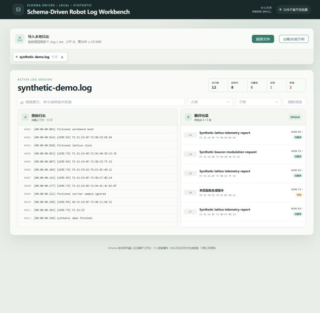

# Schema-Driven Robot Log Workbench

## Schema 驱动的机器人日志解析工作台

**Author & Maintainer: [ZC-peng](https://github.com/ZC-peng)**

一个纯浏览器运行的 Vue 3 工作台：使用受限协议 Schema 和确定性 Parser，将机器人十六进制日志转换为可搜索、可筛选、可定位的结构化结果，并通过双侧虚拟列表处理大数据量浏览。

`Vue 3` · `TypeScript` · `Vite` · `Pinia` · `Zod` · `Vitest` · `Playwright`

**AI-assisted engineering：**AI Coding 用于方案探索、虚拟列表初版实现和边界场景枚举；需求约束、Schema/Parser 设计、代码审查、Golden Case、自动化测试与性能验证由作者负责。可审查案例见 [Schema Validation](docs/ai-cases/schema-validation.md) 与 [Virtual List](docs/ai-cases/virtual-list.md)。

### 现在可以做什么

- 导入多份 UTF-8 `.log` / `.txt` 文件，或一键加载内置合成示例；
- 按通信方向、日志级进程类型、大类和子类匹配协议；
- 将目标行解析为 `translated`、`unknown` 或 `malformed`，单条异常不阻断后续日志；
- 在多会话中搜索说明、原文和字段，按大类/子类筛选；
- 从右侧结构化结果定位并高亮左侧原始行；
- 用左右双侧固定高度虚拟列表控制大数据量下的实际 DOM 数量。



### 60 秒运行

要求 Node.js `>=20.19.0`、npm `>=10`。

```bash
npm install
npm run dev
```

打开 Vite 提供的本地 `http://` 地址，然后点击“加载合成示例”。Windows 用户完成一次 `npm install` 后，也可以双击根目录的 `start-app.cmd`。

> **公开边界：**本仓库是作者在实习结束后完成的个人脱敏重构，所有协议、日志、Golden Case 和 E2E fixture 均为完全合成数据。它不是任何公司的源码，也未连接任何公司内部系统。

---

## 核心数据流

```text
本地日志文件
  ↓
浏览器读取与文本解码
  ↓
识别目标行与通信方向
  ↓
日志级 single / multi 判定
  ↓
Protocol Schema 索引查找
  ↓
字段 offset / enum / condition 解释
  ↓
Pinia 多会话状态
  ↓
双栏搜索、筛选、定位与虚拟化渲染
```

运行时不调用 LLM、后端 API 或远程协议服务。协议解释由确定性规则完成，同一输入和同一协议版本产生可重复结果。

## 关键设计

### 1. 受限 Schema，而不是任意脚本

协议目录描述进程类型、通信方向、命令选择器和字段规则。加载阶段先用 Zod 检查结构，再执行跨记录语义校验，包括重复 key、offset 覆盖和条件分支冲突。

受限表达能力使规则更容易检查和测试；它不执行协议文件中的任意 JavaScript，也不声称覆盖 TLV、动态长度、位域或所有机器人协议。

### 2. 确定性 Parser 与稳定问题结果

Parser Core 与 Vue、Pinia 和网络解耦。它扫描目标行、解码十六进制、完成日志级进程判定，再查找协议和解释字段。

- 目录命中且字段合法：`translated`；
- 输入合法但协议未收录：`unknown`；
- 十六进制、字节长度或日志级条件不合法：`malformed`。

问题结果保留原始行号和上下文，避免一个坏样本导致整份日志无法继续查看。

### 3. 双侧固定高度虚拟列表

左侧原文和右侧解析结果都只挂载可视区与 overscan 范围。spacer 提供逻辑总高度，渲染窗口通过 `translate3d` 放回正确位置；`ResizeObserver` 更新 viewport，controller 提供索引定位能力。

详情放在独立抽屉中，因此当前实现保持固定行高，不宣称支持任意动态高度行。设计取舍见 [ADR-0001](docs/adr/0001-fixed-height-lists.md)。

### 4. 浏览器本地处理

文件读取、协议匹配、解析和交互都在浏览器中完成，源码中没有上传日志的业务 API。浏览器本地处理减少了不必要的传输面，但不等于绝对安全；浏览器扩展、开发者工具、截图和第三方脚本仍属于需要单独治理的风险。

## 项目结构

```text
apps/web
├─ 文件导入与多会话状态（Pinia）
├─ 双栏工作区、搜索与筛选
└─ 详情抽屉与定位交互

packages/protocol-schema
├─ Zod 结构校验
├─ 跨记录语义校验
└─ 协议索引

packages/parser-core
├─ 目标行扫描与十六进制解码
├─ 日志级 single / multi 判定
└─ Schema 字段解析与问题结果

packages/virtual-list
├─ 固定高度 range / offset 纯函数
└─ Vue FixedVirtualList 与 scrollToIndex

packages/test-fixtures
└─ 合成协议、日志、Golden Case 与数据生成器
```

## 验证

```bash
npm run validate:protocols
npm run typecheck
npm run lint
npm run test
npm run build
npm run test:e2e
```

测试层次分别覆盖：

- Protocol Schema 的结构与跨记录语义约束；
- Parser 的正常结果、条件字段、Unknown、Malformed、混合进程和源行定位；
- Virtual List 的首尾范围、overscan、快速滚动、尺寸变化和 DOM 上界；
- Web 工作区的示例加载、多文件会话、搜索筛选和结果定位。

Golden Case 只证明合成规则下的预期行为稳定，不代表真实设备协议准确率。

## 可复现性能证据

```bash
npm run bench:parser
npm run bench:browser
npm run bench:tab-switch-ab
```

仓库保留固定 seed、环境说明和原始 JSON。一个已保存的本地合成数据基准中：

| 场景 | 结果 |
|---|---:|
| 30k 行 `import-to-ready` | median `232.4 ms` / p95 `238.3 ms` |
| 30k 行 Tab 切换 | median `8.6 ms` / p95 `8.8 ms` |
| 30k 行结果定位 | median `11.1 ms` / p95 `11.3 ms` |
| 100k 行压力样本导入 | median `524.5 ms` / p95 `559.3 ms` |

两轮单侧/双侧虚拟化 A/B 使用 30k 原始行和 3k 条结果：右侧完整渲染时挂载 3,000 行，Tab 切换 median 为 `308.3～327.0 ms`；双侧虚拟化实际挂载 13 行，两轮 median 均为 `11.1 ms`，每种方案每轮各 30 个正式样本；对应中位数降幅为 `96.40%` 与 `96.61%`。

这些数字只属于当前重构在指定机器、Vite 开发模式、headless Chrome 和完全合成数据下的结果。它们不是生产指标、实习期间的数据或通用 SLA，也不能证明 FPS、内存和研发效率。完整口径见 [Benchmark 说明](benchmarks/README.md) 与 [Tab 切换 A/B](benchmarks/tab-switch/README.md)。

## 当前限制

- 单文件演示上限为 25 MiB，仅支持 UTF-8 文本；
- 当前会话保存在内存中，刷新恢复尚未实现；
- Parser 仍在主线程运行，是否引入 Worker 由测量结果决定，见 [ADR-0002](docs/adr/0002-worker-deferred.md)；
- 只实现右侧结果定位左侧原文，不包含实时双向滚动联动；
- 虚拟列表采用固定高度行与独立详情抽屉，不支持任意动态高度；
- 不读取真实设备，不调用 ADB、WebUSB 或 Web Serial；
- 不包含后端、账号系统、数据库、运行时 LLM、Agent 或 RAG。

## 项目来源与真实性边界

本项目的业务问题来源于作者实习期间接触过的日志解析场景，但当前仓库是在实习结束后重新设计和实现的公开作品：

- 不包含原公司的源码、截图、名称、域名、接口或部署配置；
- 不包含真实设备协议、用户日志或商业数据；
- 所有公开数据由本仓库的合成规则和 fixture 构造；
- 当前架构、测试和 benchmark 只能证明本仓库状态，不能反推原项目实现；
- 尚未实现的能力不会写成当前特性。

## 使用边界

Copyright © ZC-peng. 本仓库暂未添加开源 License，package metadata 标记为 `UNLICENSED`；仓库仅用于作品集展示与技术交流。
